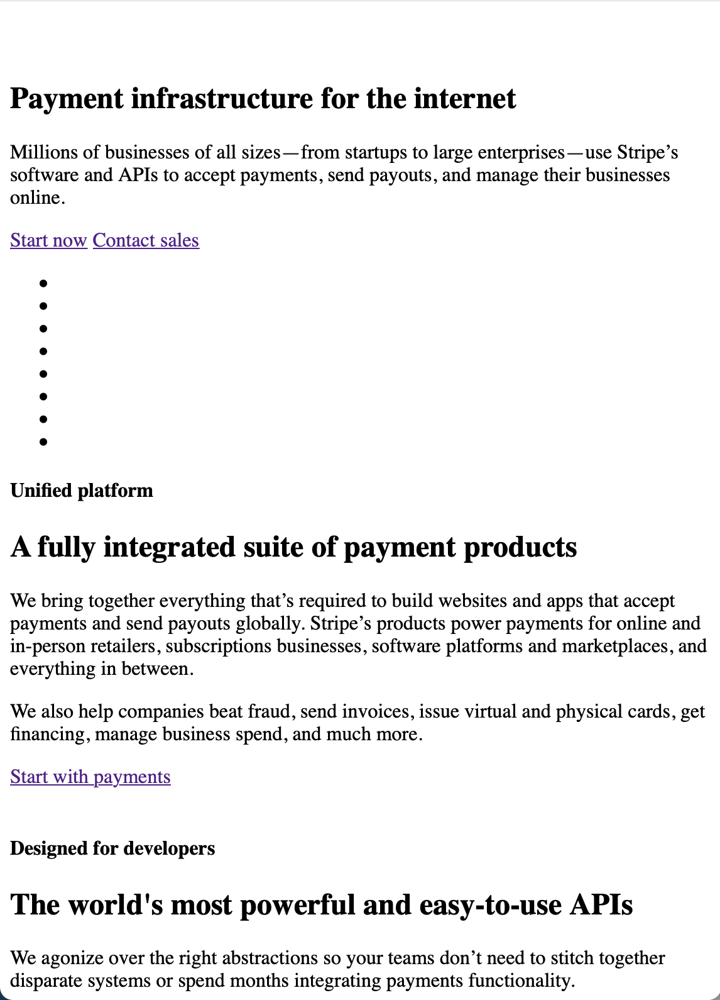

# Procesverslag
**Auteur:** -jouw naam-

Markdown cheat cheet: [Hulp bij het schrijven van Markdown](https://github.com/adam-p/markdown-here/wiki/Markdown-Cheatsheet). Nb. de standaardstructuur en de spartaanse opmaak zijn helemaal prima. Het gaat om de inhoud van je procesverslag. Besteedt de tijd voor pracht en praal aan je website.

## Bronnenlijst
1. https://www.sitepoint.com/css3-transform-background-image/

## Eindgesprek (week 7/8)

-dit ging goed & dit was lastig-

**Screenshot(s):**

-screenshot(s) van je eindresultaat-

## Voortgang 3 (week 6)

### Stand van zaken

Nog steeds even ver als bij het eerste voortgangsgesprek.

### Verslag van meeting

In het gesprek kregen we een paar tips voor de eindversie. 

1. Vergeet geen mediaqueries toe te voegen
2. Voldoe aan alle voorwaarden van de opdracht
3. Gebruik semantische elementen
4. Zet overal goede bijschriften bij
5. Zorg dat de site toegankelijk is voor screenreader (kan je tabben over de pagina? Veranderd een knop na klikken van kleur?)

## Voortgang 2 (week 5)

Niet aanwezig

## Voortgang 1 (week 3)

### Stand van zaken

Het ontleden van de website in de verschillende elementen was goed te doen. Vervolgens het skelet van de HTML aangemaakt.

**Screenshot(s):**

### Verslag van meeting

Goed basis begin gemaakt van de website, maar nog veel te doen voor de opmaak!

## Intake (week 1)

**Je startniveau:** -kies uit zwart, rood óf blauw-

**Je focus:** -kies uit responsive óf surface plane-

**Je opdracht:** [Stripe](https://stripe.com/en-nl "Stripe Homepage")

**Screenshot(s):**

**Breakdown-schets(en):**

