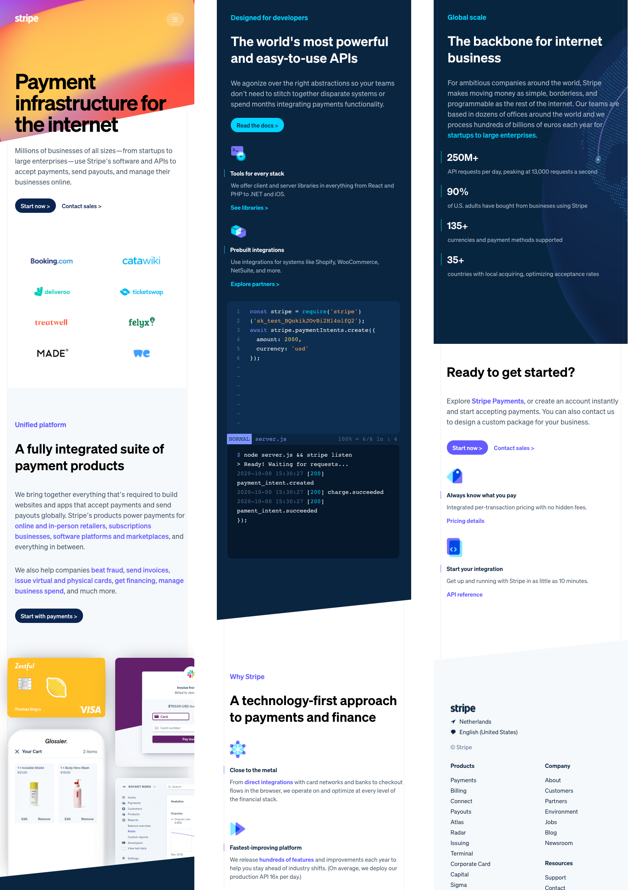
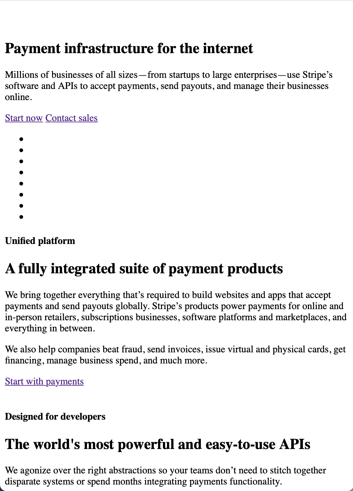
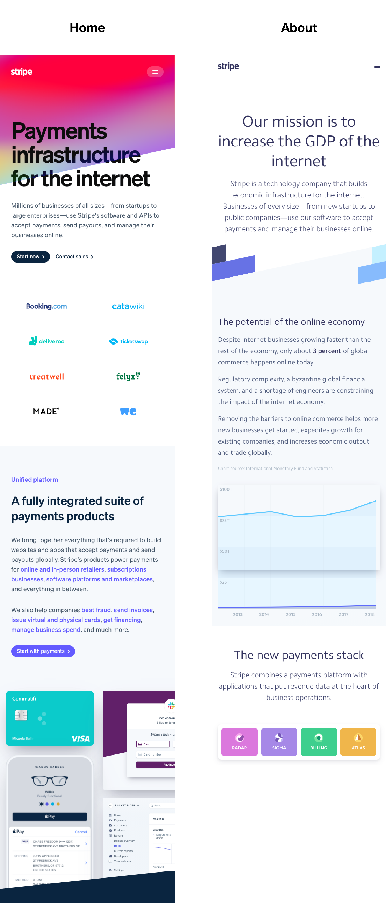
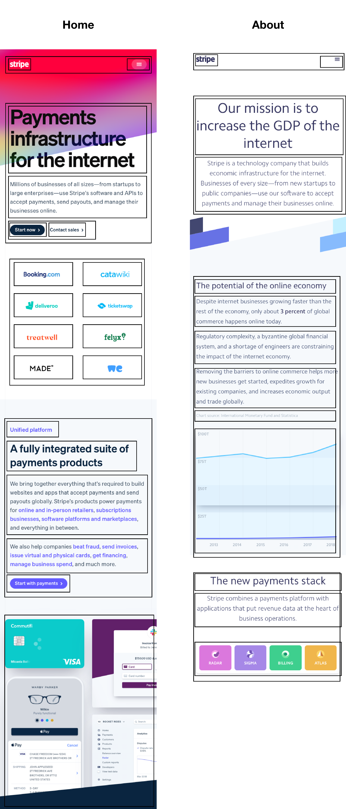

# Procesverslag
**Auteur:** Elias Poolman

## Bronnenlijst
1. https://www.sitepoint.com/css3-transform-background-image/
2. https://medium.com/better-programming/improving-font-rendering-with-css-3383fc358cbc
3. https://www.sitepoint.com/css3-transform-background-image/
4. https://www.w3schools.com/cssref/pr_background-image.asp
5. https://stackoverflow.com/questions/19469495/css-slow-hover-effect
6. https://www.cssmatic.com/box-shadow
7. https://www.w3schools.com/js/js_htmldom_eventlistener.asp

## Eindgesprek (week 7/8)

De home pagina was af en zag er goed uit, de tips om mee te nemen waren
1. micro-interactie verder uitwerken
2. niet bestaande container tag weghalen
3. semantische html gebruiken

To-do voor eindversie (naast de About pagina maken)
1. animaties toevoegen d.m.v. keyframes
2. form werkend maken
3. video's toevoegen website

## Voortgang 5 (week 8)

### Stand van zaken

Begin gemaakt van de About page.

## Voortgang 4 (week 7)

### Stand van zaken

De home-pagina van Stripe is nu helemaal af. Er zijn bij bepaalde schermgroottes nog problemen met de achtergrondelementen, die dekken in sommige gevallen niet helemaal af. 
Verder is de typografie gedaan en staan alle afbeeldingen erin.
Je kunt tabben over de pagina en de links veranderen van kleur.

## Voortgang 3 (week 6)

### Stand van zaken

Geen voortgang, wel gesprek.

### Verslag van meeting

In het gesprek kregen we een paar tips voor de eindversie. 

1. Vergeet geen mediaqueries toe te voegen
2. Gebruik semantische elementen
3. Zet overal goede bijschriften bij
4. Zorg dat de site toegankelijk is voor screenreader (kan je tabben over de pagina? Veranderd een knop na klikken van kleur?)

## Voortgang 2 (week 5)

Geen voortgang.

## Voortgang 1 (week 3)

### Stand van zaken

Ik heb gekozen voor stripe.com omdat ik de site er heel mooi uit vindt zien door de typografie en het kleurgebruik.

Als eerste stap heb ik de content in de website gezet. Zie hierbij een screenshot van de site zonder CSS.

**Screenshot(s):**

### Verslag van meeting

In de meeting kwam naar voren dat dit de eerste stap is en dat er nog veel te doen is voor de opmaak!

## Intake (week 1)

**Je startniveau:** -rood-

**Je focus:** -surface plane-

**Je opdracht:** [Stripe](https://stripe.com/en-nl "Stripe Homepage")

**Screenshot(s):**

**Breakdown-schets(en):**

